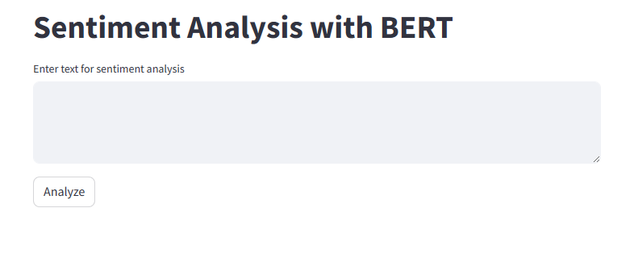

# Sentiment2Stock Prediction Platform

This repository contains the code and models for the Sentiment2Stock Prediction Platform, a tool designed to analyze sentiment in textual data and predict stock prices based on sentiment scores.

## Overview

The Sentiment2Stock Prediction Platform leverages state-of-the-art machine learning and natural language processing techniques to understand the sentiment behind textual data and forecast stock market movements.

## Features

- Sentiment Analysis: Analyze the sentiment of textual data using advanced NLP models.
- Stock Price Prediction: Predict future stock prices using sentiment analysis results.
- Data Visualization: Visualize sentiment scores and stock price predictions in an interactive manner.
- Streamlit Integration: A user-friendly web interface for easy interaction with the platform.

## Structure

- `data`: Contains datasets used for model training and analysis.
- `images`: Stores images used in the Streamlit application and README.
- `models_LLM`: Includes trained models for sentiment analysis.
- `models_gan`: Stores GAN models specialized for stock price prediction.
- `notebooks`: Jupyter notebooks for exploratory data analysis and model training.
- `plots_gan`: Generated plots from GAN models during training.
- `scalers`: Scaler objects for data normalization.
- `scripts`: Core scripts for the platform's functionality.
- `streamlit_pages`: Individual Streamlit application pages for different functionalities.
- `.gitattributes`: Git attributes file for LFS tracking.
- `README.md`: This README file for repository documentation.
- `model_result.txt`: Output results from model predictions.
- `requirements.txt`: List of Python package requirements for the platform.
- `transformers`: Directory for transformer models (if applicable).

## Installation

To set up the Sentiment2Stock Prediction Platform, follow these steps:

1. Clone the repository:

git clone https://github.com/SamouchH/Sentiment2Stock.git


2. Navigate to the repository directory:

cd Sentiment2Stock


3. Install the required Python packages:


pip install -r  requirements.txt

## Streamlit Application

Our platform includes a user-friendly Streamlit web application that provides an intuitive interface for interacting with the sentiment analysis and stock prediction features.

### How to Access the Streamlit Application

To access the Streamlit application:

1. Ensure you have Streamlit installed. If not, install it using pip:
   ```bash
   pip install streamlit

2. Run the Streamlit application : 
stramlit run streamlit_pages/app.py

3. The application will open in you default web browser

### Features

The Steamllit application includes the following pages : 

* **Home** : The landing page with an introduction to the platform.
* **Sentiment Analysis** : Perform sentiment analysis on stock-related news and tweets.
* **Visualize** : View interactive visualizations of sentiment trends over time.
* **Predict** : Access predictive models to forecast stock prices.
* **Future Work** : Learn about upcoming features and enhancements.

Navigate through the application pages using the sidebar to access different functionalities.


### Screenshots

Here are some screenshots that highlight the key features of the Streamlit application:

#### Home Page


#### Sentiment Analysis Page


#### Visualization Page


#### Prediction Page


#### Future Work Page


### Navigation

Use the sidebar to navigate to different pages of the application and access various features.


We encourage users to explore different pages and interact with the functionalities provided.


## Future Work and Roadmap

Here we outline the upcoming features and enhancements planned for this project. Our roadmap is a glimpse into the future of this application, detailing the exciting developments ahead.

### Model Enhancements

We are exploring advanced model architectures and more sophisticated hyperparameter tuning strategies to improve accuracy.

### Real-time Stock Price Visualization

A real-time stock price plot will be implemented to provide live financial data visualizations.

### Utilizing Reinforcement Learning

We plan to investigate reinforcement learning techniques for better predictive modeling and to inform trading strategies.

### Preview of Upcoming Features

Below is a sneak peek of what we are working on:


*Screenshot of the planned real-time stock price visualization feature.*


### Stay Tuned

Stay tuned for more updates as we continue to enhance our platform with these exciting new features.

---

We hope you find our Stock Analysis Platform insightful and easy to use. For any queries or suggestions, please raise an issue in the repository, or contact us directly.


## Contact

For any questions or concerns, please open an issue in the repository or contact the repository owner directly.

---

This README is a brief overview of the Sentiment2Stock Prediction Platform. For more detailed information, please refer to individual directories and code comments within the repository.


